# Agent Orchestrator

Agent Orchestrator is a window on **your computer**. You chat with models that already run here or on a box you started. Other apps (like Late) can use it as MCP.

Writes wait for **Approve**. Keys stay on this computer. Bind is loopback (`127.0.0.1`).

## How it works

1. You start it on this computer (`npm run gui`, or the app from Releases).
2. You open the local page it prints. That URL is only for this machine.
3. You type in Chat. **Auto** picks who speaks. Implement/install still waits for **Approve**.
4. If you want Late (or another client) to use this as the agent, click **Copy MCP URL**. It is `/mcp` on the **same port as the web UI**, not always 8787. The HTML page is not MCP.

That is the whole idea.

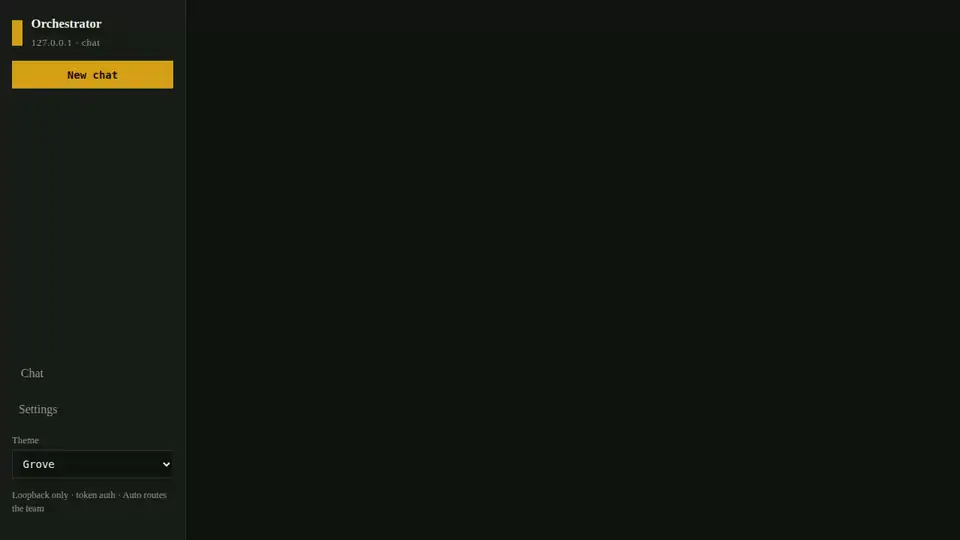

Chat on this computer, then **Copy MCP URL** for Late. The address is `127.0.0.1` on the port this process printed.

```
Chat (GUI or MCP)
  → Auto router (control tools | single agent | multi-agent debate)
      → Cursor (local or cloud) — can edit allowlisted directories
      → External models — text only
      → Local model server on 127.0.0.1 — never public
```

## Watch it


This clip is **Debate** on **your computer**: local Gemma, Cursor local, and Cursor cloud each get a turn. Gemini returned 429 and was skipped. You read the replies. Writes still wait for **Approve**.

## What’s in the archive

Ollama and llama-server are in the zip/tarball. **Weights are not.** vLLM Start still needs Docker. Bind stays `127.0.0.1`. This app does not start inference on another host.

| What you get | Picture |
|---|---|
| What is packed | 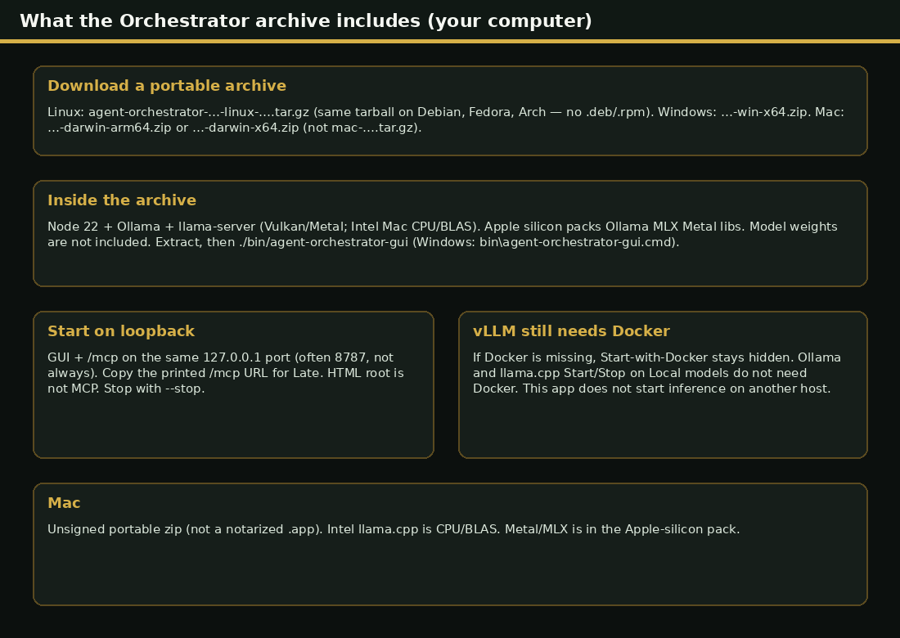 |
| Start / Stop on Local models | 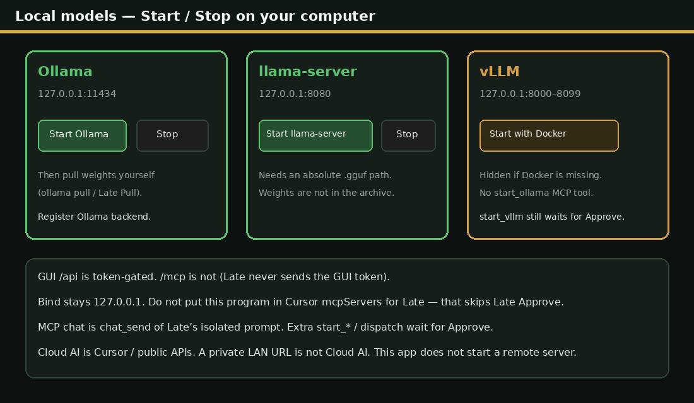 |
| GUI vs `/mcp` | 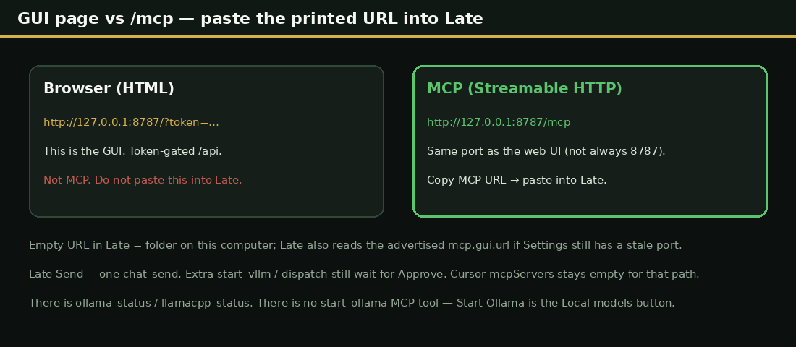 |

### Four steps

| 1 | 2 | 3 | 4 |
|---|---|---|---|
| [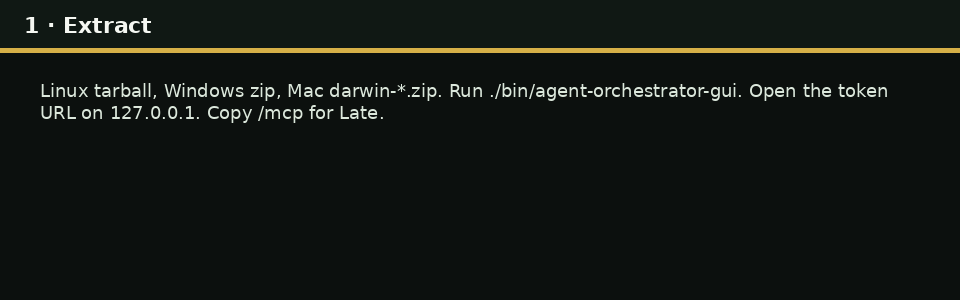](docs/images/01-extract.png) | [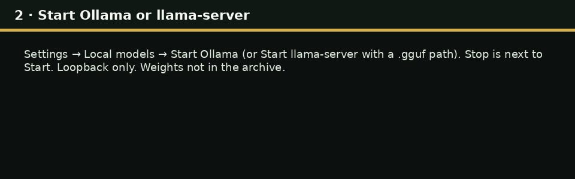](docs/images/02-start-ollama.png) | [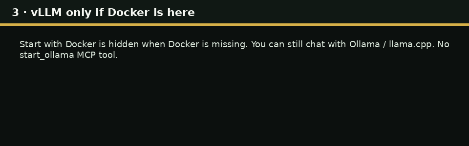](docs/images/03-vllm-docker.png) | [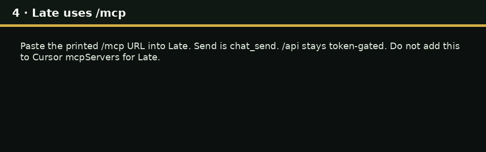](docs/images/04-late-mcp.png) |

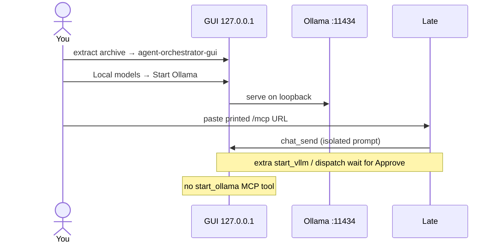

## Install

Download a portable build from **[Releases](https://github.com/Unaware-Kerbin/agent-orchestrator/releases)** (tag [v0.1.2](https://github.com/Unaware-Kerbin/agent-orchestrator/releases/tag/v0.1.2)). Each archive includes Node 22. Extract it, then:

| Your computer | File | What you do |
|---|---|---|
| Linux | `agent-orchestrator-…-linux-….tar.gz` | Extract, run `./bin/agent-orchestrator-gui`. Same tarball on Debian, Fedora, Arch (no `.deb` / `.rpm`). |
| Mac (Apple silicon) | `agent-orchestrator-…-darwin-arm64.zip` | Extract, run `./bin/agent-orchestrator-gui`. Unsigned zip — **not** `mac-….tar.gz`. Metal/MLX in this pack. |
| Mac (Intel) | `agent-orchestrator-…-darwin-x64.zip` | Same. llama.cpp is CPU/BLAS. |
| Windows | `agent-orchestrator-…-win-x64.zip` | Extract, run `bin\agent-orchestrator-gui.cmd` |

That starts the loopback GUI and Streamable HTTP **`/mcp` on the same port**. Copy the printed URL for Late. Stop with `--stop`. Bind stays `127.0.0.1`. Ollama and llama.cpp are in the archive (Start on the Local models page). vLLM Start still needs Docker — if Docker is missing, **Start with Docker** stays hidden.

The Linux file is a portable tarball — it is not tied to one distro. There is no `.deb` or `.rpm` (this project packs a Node runtime archive, not an fpm/electron-builder installer).

Or install from source below.

## Quick start

Requires Node.js 22.13+.

```bash
npm install
cp .env.example .env
```

Put API keys in `.env` or in the GUI **Backends** page — never in `agents.config.yaml`. `apiKeyEnv` is the **variable name** (`GEMINI_API_KEY`), not the secret.

```bash
# GUI (loopback only)
npm run gui
```

Open the token URL from stderr (`http://127.0.0.1:<gui-port>?token=…`). The session token is stored at `.orchestrator/gui.secret` (gitignored). The GUI also serves Streamable HTTP at **`/mcp` on that same port** (no GUI token). Copy that exact URL from stderr or GUI Settings → **Copy MCP URL** — it is the port this process bound, not always 8787. On listen it writes `.orchestrator/mcp.gui.url` (and last-writer `mcp.url`) plus `~/.config/agent-orchestrator/` (or `$XDG_CONFIG_HOME`) so a client like Late can find a non-default port. Dedicated `npm run mcp:http` writes `mcp.http.url` separately so it does not hide the GUI URL.

**Late** uses only the printed Streamable HTTP `/mcp` URL (same port as the GUI, or `npm run mcp:http`). Do not put this program in Cursor `mcpServers` for Late — that skips Late Approve and must not receive API keys. `npm start` / [`.cursor/mcp.json`](.cursor/mcp.json) is stdio for **this repo’s Cursor IDE**, not the Late operator path.


The HTML root is the GUI. `/mcp` on that same port is Streamable HTTP (a JSON body, not the chat page). Paste the printed `/mcp` URL into Late.

### Windows

Same Node 22.13+ and `npm` commands work in PowerShell or cmd. Loopback bind and GUI auth are unchanged (`127.0.0.1` only).

```powershell
npm install
copy .env.example .env
npm run gui
```

Open the token URL from stderr. Stop with `npm run gui:stop`. Late still uses the printed `/mcp` URL. `npm start` is stdio for this checkout’s Cursor IDE only (`node` + `tsx/dist/cli.mjs`, not a Unix `.bin` shim) — not the Late operator path.

Local models on **your computer** talk to `127.0.0.1`:

- **Ollama** — packed installs include `runtime/bin/ollama`. Start it from Local models, or use one you already run (`%LOCALAPPDATA%\Programs\Ollama\ollama.exe`).
- **llama.cpp** — packed installs include `llama-server` (Vulkan/Metal; Intel Mac is CPU/BLAS). Start with `--host 127.0.0.1` and a GGUF path. Weights are not in the archive.
- **vLLM** — Windows CUDA wheel when you have NVIDIA + `nvidia-smi`; host `vllm` / `python -m vllm`. AMD: ROCm tools (`amd-smi`) when present.
- **Docker Desktop** — optional for vLLM. NVIDIA GPU in Docker Desktop can work when GPU support is enabled. **Intel XPU / `/dev/dri` images are a Linux path**; on Windows use WSL2 or a Linux host, or skip Intel Docker. If Docker is missing, vLLM Start-with-Docker stays hidden.

Hardware detect uses `nvidia-smi` (including `C:\Windows\System32` / NVIDIA NVSMI), Win32 video controllers, and vendor CLIs when present — not Linux `lspci` / sysfs. If probes fail, the GUI shows a reason instead of crashing.

State stays in `.orchestrator` under the repo (or `AGENT_ORCHESTRATOR_STATE_DIR`). Write-allowlist paths may use drive letters (`C:\Users\…`). POSIX `0600`/`0700` bits do **not** apply on NTFS; use folder ACLs if the machine is shared.

| Command | Purpose |
| --- | --- |
| `npm run gui` | Control plane on loopback GUI port (`AGENT_ORCHESTRATOR_GUI_PORT`, default 8787: web UI + `/mcp`) |
| `npm run gui:stop` | Stop that process |
| `npm run gui:restart` | Stop then start |
| `npm start` | Stdio MCP server |
| `npm run mcp:http` | Dedicated Streamable HTTP MCP (`AGENT_ORCHESTRATOR_MCP_PORT`, default 8790 `/mcp`) |

Late Settings is optional. Paste the printed `/mcp` URL, or leave Late’s address empty and let it read the advertised file. That URL uses the port this process actually bound — not a hardcoded 8787. `/MCP` is the same route. Late will not start this process and works with MCP off.

If the GUI port is already in use, the GUI is already running — use `gui:stop` or open the existing token URL. Stopping a local model container does **not** stop the GUI.

This checkout’s [`.cursor/mcp.json`](.cursor/mcp.json) is **Cursor IDE for developing this repo**, not the Late operator path. It does not pass API keys. Late pastes the printed `/mcp` URL and keeps Approve. `list_agents` re-reads env and GUI secrets without a full IDE restart.

## Chat

Home is a chat thread. The header (new chat, thread switcher, settings) and composer stay on screen; only messages scroll.

- **Auto** (default) — control tools for hardware/download/start; debate for plan/fix/review when two or more backends are ready, and whenever two or more local servers (vLLM, Ollama, llama.cpp) are running; otherwise a single agent.
- **Debate** — round-table: each ready model speaks in turn (one bubble per speaker), then a closer synthesizes.
- **Single** / pin a backend — that backend only.

While a speaker runs, a **thinking** chip shows name, elapsed time, and phase so the UI does not look hung.

## On your computer (short how-tos)

| Do this | How | Picture |
|---|---|---|
| Start / Stop local servers | **Settings → Local models**. **Start Ollama** / **Stop**, or **Start llama-server** with an absolute `.gguf` path. Loopback only. Weights are not in the archive. |  |
| vLLM | **Start with Docker** only if Docker is on this computer. Hidden when Docker is missing. Ollama / llama.cpp still work. | 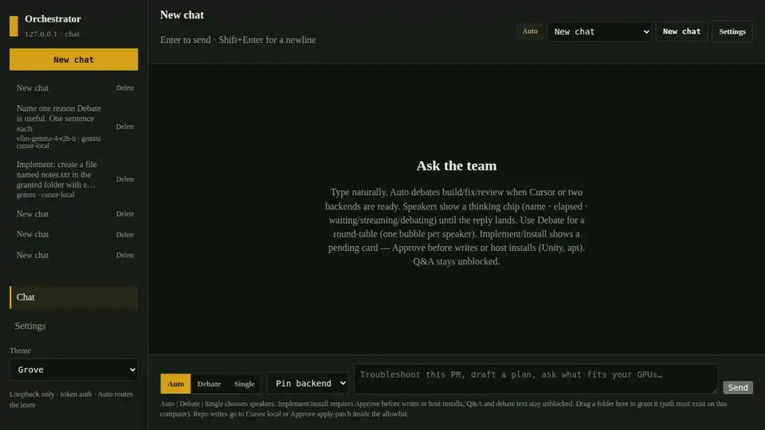 |
| MCP for Late | **Copy MCP URL** → paste `/mcp` into Late. HTML root is not MCP. Empty Late URL = folder. Send is `chat_send`. Extra `start_*` wait for Approve. Do **not** put this in Cursor `mcpServers`. |  |
| Token-gated `/api` | Open the printed `?token=` URL. GUI `/api/*` needs that session token. `/mcp` does not (Late never sends it). | 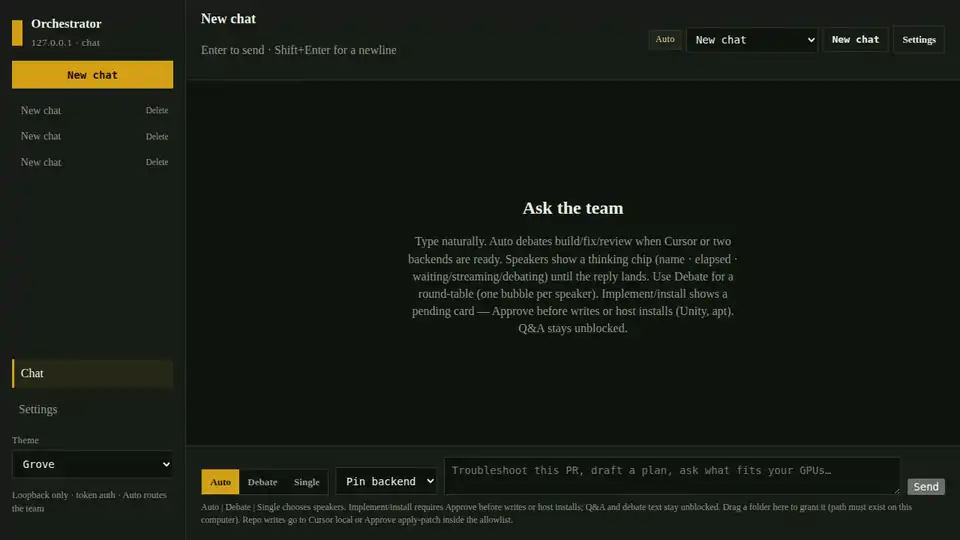 |
| MCP tools | `chat_send`, `list_agents`, `start_vllm`, `ollama_status`, `llamacpp_status`, … There is **no** `start_ollama` tool — Start Ollama is the Local models button. |  |


This clip is **Debate** on **your computer**: paste a prompt (do not drip-type). Local Gemma, Cursor local, and Cursor cloud each spoke. Gemini returned 429 and was skipped. Writes still wait for **Approve**.

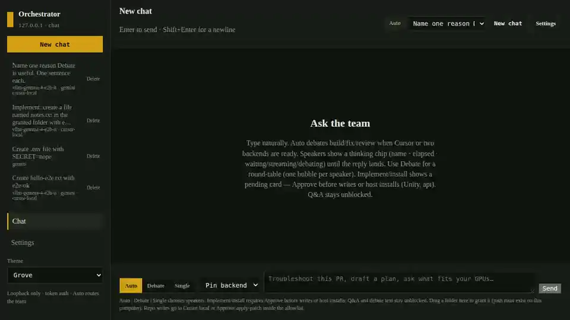

**Delete** next to a thread removes that chat. It cannot be undone.

**Writes and installs wait for Approve.** Implement/install stays plan-only until you click **Approve** on the pending-actions card. After that, Cursor may write **only inside the write allowlist**. If Cursor is missing, **Approve** still writes with Node apply-patch in that granted folder. Host-wide installs (package managers, game engines, `sudo`) are called out and still wait. External models never edit files.


Grant a folder that already exists on this computer, then **Approve**. This capture created `notes.txt` (not `.env`) with Cursor local. The file still lands only inside the granted path.

## Settings

| Page | What it does |
| --- | --- |
| Backends | Ready/not-ready, paste keys (masked), Gemini model id, nicknames, custom logos |
| Local models | Detect GPU VRAM, recommend weights that fit, download, start/stop/remove local servers. **Hugging Face token** (gated Gemma/Llama/Mistral): paste a Hub read token; status is configured/not; value is never returned |
| Allowlist | Directories Cursor may write to |
| Updates | Check GitHub for this app and Late. Ask before download. Cloud AI is not required. |
| Config | Edit `agents.config.yaml` (validated; no live keys) |
| Run workflow | Optional named pipelines |
| Theme | Appearance for this browser. Stored in localStorage (`orchestrator.gui.theme`), not in git. |


Ready vs not-ready. Keys stay masked. Nicknames and logos are optional. **Reload env** picks up a key added after start.


**Updates:** **Check for updates** asks GitHub for Late and this app. Then pick **Update Late**, **Update Orchestrator**, or **Update both**. Nothing downloads until you confirm **Download on your computer?** Cloud AI is not required.

Keys live in `.env` and `.orchestrator/secrets.env` (gitignored). On POSIX the orchestrator creates secret/state files as mode `0600` and directories as `0700`, then `chmod`s again after overwrite (Node’s `mode` option only applies when creating a new file). **Windows does not honor Unix permission bits** — Node can only toggle the read-only flag, not user vs group vs others. If other accounts use the machine, restrict the repo folder with NTFS ACLs (your user only). **Reload env** picks up a key added after start.

**Cursor** (`cursor-local` and `cursor-cloud`) uses the env name `CURSOR_API_KEY`. Paste it in GUI **Settings → Backends**, or set it in `.orchestrator/secrets.env` / `.env`. Get a key from [Cursor Dashboard → Integrations](https://cursor.com/dashboard/integrations). Never commit the value. If it is missing, chat shows **Cursor not configured** (one line, no stack). Local Cursor uses the MCP process working directory when that path is on the write allowlist — not a hardcoded home path.

Nicknames are stored on each backend in `agents.config.yaml` (`nickname: Arc Qwen`). Custom logos are PNG/JPEG/WebP files under `.orchestrator/logos/` (gitignored, 512 KiB max; SVG/HTML rejected by magic bytes). Chat bubbles and Settings use the nickname and logo when set.

The GUI **Theme** picker (sidebar, Chat → Settings, and Overview) is per browser/profile so people sharing a machine can keep their own look. It is not stored in git.


## Security

| Property | Behavior |
| --- | --- |
| Bind | GUI and HTTP MCP bind **`127.0.0.1` only** (ports from `AGENT_ORCHESTRATOR_GUI_PORT` / `AGENT_ORCHESTRATOR_MCP_PORT`, defaults 8787 / 8790). Local model HTTP is loopback. |
| Auth | GUI `/api/*` requires the session token. Streamable HTTP `/mcp` does not (Late never sends it). Loopback Host + Origin are the boundary — any process on this computer can call mutating tools (`chat_approve`, `dispatch`, `add_allowed_dir`). Pairing a token on `/mcp` would break Late unless Late starts sending one. Do not tunnel `/mcp`. Late Approve is Late’s sidecar when Late is the client. |
| GUI token | Open the printed `?token=` URL. The token is stored in sessionStorage and stripped from the address bar. EventSource `/api/events` still uses a query token because the browser cannot set `Authorization` on EventSource. Logo URLs use the same query form. Loopback only. |
| Origin | Non-loopback `Host` is rejected. GUI `/api` Origin must match this port. Streamable HTTP `/mcp` allows any loopback Origin (Late UI / sidecar) or none. |
| Secrets | Never logged or shown in full. Not committed. POSIX files `0600`; Windows needs NTFS ACLs. |
| Writes | Realpath + allowlist; `..` and symlink escapes fail. |

Do not tunnel the GUI or vLLM. Cloud Cursor agents cannot reach localhost; the orchestrator passes **text** between local and cloud.


The rail says `127.0.0.1`. Local vLLM is the same bind. This page is only for **your computer**.

## Write allowlist

Default: this workspace (`WORKSPACE_CWD` / `workspace.cwd`). Add more via Settings → Allowlist or `add_allowed_dir`. Chat offers one-click add when you name an absolute path that is not listed. Drag a folder onto Chat (or paste a path). The path must already exist on **this computer** (the one running the GUI).

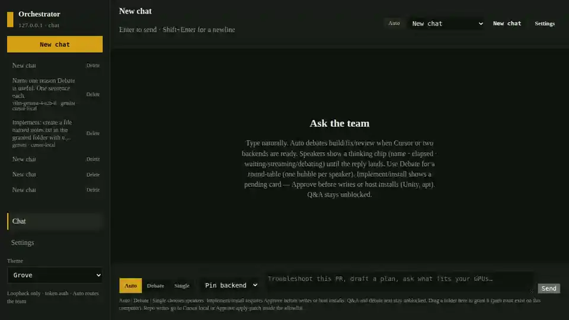

## Local models (vendor-agnostic)

`list_hardware` probes **whatever accelerators are present** (NVIDIA CUDA, AMD ROCm, Intel XPU, or CPU if none). Recommendations use **measured VRAM**, not a single vendor. Missing NVIDIA is not treated as “CPU only” when another GPU exists.


Search the catalog by name (this clip types `gemma`). Recommended rows say whether a snapshot fits **this computer**.

A catalog model **fits** a single GPU when estimated weights plus ~20% KV-cache headroom are ≤ that GPU’s VRAM. `start_vllm` uses **every GPU on this computer** by default (`vllm serve --tensor-parallel-size N`). Pass `use_all_gpus=false` to stay on one card. A larger model can still *fit* via tensor parallel when weight shards fit in combined VRAM. Remaining memory on each card is used for the KV cache (`--gpu-memory-utilization 0.9`). The catalog is **not** tied to one vendor: it includes Qwen 2.5/3/3.5/3.8, Gemma 2 and Gemma 4 Instruct, Llama 3.1/3.3/4 Scout, Mistral 7B and Small 3.2, Phi-4, OLMo 2/3, IBM Granite 3.3/4.2, and DeepSeek-R1 Qwen distills. **Recommendations** list every catalog snapshot (no top-8 cap) with fit flags for this computer (fits / needs tensor parallel / too big). Newest Hub id is marked when a family has several names (Gemma 4 over Gemma 2/3, Qwen3.8 over Qwen2.5). Older generations stay downloadable. FP16 rows work on CUDA, ROCm, and Intel XPU; AWQ/GPTQ rows are CUDA/ROCm only. Official Gemma 2 ([Gemma Terms of Use](https://ai.google.dev/gemma/terms)) and Llama (Llama Community License / Llama 4 Community License) Hugging Face repos are **gated**. Gemma 4 Instruct is **ungated Apache-2.0**. Community Llama AWQ snapshots in the catalog are ungated on Hugging Face but still under the Llama Community License. You can still download any other `org/name` snapshot that vLLM can load.

Download snapshots into `.orchestrator/models` (gitignored, must stay on the allowlist).

**Gated Hugging Face models** (Gemma, Llama, Mistral, and similar Hub gates):

1. While logged into your Hugging Face account, open the model card and **accept the license / access terms** (Gemma 2: Gemma Terms of Use; Llama 4: Llama 4 Community License).
2. Create a **read** access token at [huggingface.co/settings/tokens](https://huggingface.co/settings/tokens). Paste it in the GUI: **Settings → Local models → Hugging Face token** (stored as `HF_TOKEN` in gitignored `.orchestrator/secrets.env`). `HUGGING_FACE_HUB_TOKEN` in env or that same secrets file is also honored. Do not put the token in `agents.config.yaml` or git.
3. The GUI never returns the raw token (status is configured / not configured). Clear or paste a new token to rotate. POSIX file mode is `0600`; on Windows use NTFS ACLs if the machine is shared.

The download helper uses that stored token. If it is missing, a 401 from a gated repo still tells you to set `HF_TOKEN` in the GUI or env — never commit it.

`start_vllm` picks a serving stack from the detected backend:

- **CUDA** — host `vllm serve` when the CUDA wheel is installed
- **ROCm** — ROCm vLLM when present
- **XPU** — vendor Docker images if they are already local; otherwise a host XPU build
- **CPU** — not used as a serve path

The API is published on `127.0.0.1` only (ports 8000–8099). Start returns immediately (`202`); wait on the Local models page until `/v1/models` is healthy. The running server is registered as a backend automatically (dummy loopback token if the client requires Bearer — you do not copy a key from the container).

You can run **several models at once**. Each catalog id gets its own container, port, and backend (`vllm-<catalog-slug>`). **Stop** one instance; **Remove from mix** also drops that backend from YAML; **Delete weights** is a separate confirm.

```bash
pip install -r scripts/requirements-hf.txt   # downloads
# Then install the vLLM build that matches your GPU (CUDA, ROCm, or vendor XPU/Docker).
```

### Ollama

Ollama is a local OpenAI-compat API (`http://127.0.0.1:11434/v1`). Packed installs include the binary. Start it from **Local models → Start Ollama** (loopback only). Pull weights yourself (`ollama pull llama3.1`) or from Late. Then **Register Ollama backend**.

YAML type is `ollama`. Dummy `apiKey: ollama` is not a secret. Non-loopback hosts are refused.

### llama.cpp

Packed installs include [`llama-server`](https://github.com/ggml-org/llama.cpp) (Vulkan on Linux/Windows, Metal on Apple silicon; Intel Mac is CPU/BLAS from the official zip). GGUF files are **not** in the archive. Start from Local models with an absolute `.gguf` path, or:

```bash
llama-server -m /path/to/model.gguf --host 127.0.0.1 --port 8080
# Windows: llama-server.exe -m C:\path\to\model.gguf --host 127.0.0.1 --port 8080
```

Then **Backends → Add llama.cpp backend** with `http://127.0.0.1:8080/v1`. Bind **127.0.0.1 only**.

YAML type is `llamacpp`.

Ready vLLM, Ollama, and llama.cpp backends all participate in Auto debate when two or more local servers are up. File writes still go through Cursor.

## HTTP MCP (any client)

The GUI serves Streamable HTTP at **`http://127.0.0.1:<gui-port>/mcp`** on the same process as the web UI (`AGENT_ORCHESTRATOR_GUI_PORT`). A dedicated process is **`npm run mcp:http`** → `http://127.0.0.1:<mcp-port>/mcp` (`AGENT_ORCHESTRATOR_MCP_PORT`). `/MCP` is the same route. Late does not send a GUI token. Copy the URL that process printed (or GUI Settings → Copy MCP URL). Late works with MCP off.


Paste that `/mcp` URL. Opening the HTML page in a browser is the GUI, not MCP.

```http
POST /mcp HTTP/1.1
Host: 127.0.0.1:<mcp-or-gui-port>
Accept: application/json, text/event-stream
Content-Type: application/json
MCP-Protocol-Version: 2025-03-26
```

**Late:** Settings → MCP is optional. If you turn it on, Address = the printed `/mcp` URL from this process (GUI Settings can copy it). Save, then Check. List/status tools run; starts and writes still wait for Approve. You start the GUI or `npm run mcp:http`; Late will not start it and still chats when MCP is off.

Stdio (`tsx src/index.ts`) is for this repo’s Cursor IDE only. Late still uses the printed `/mcp` URL.

### Optional ClearPass / ISE / Active Directory

Off by default (`AGENT_ORCHESTRATOR_MCP_AUTH=local-token`). Passwords and RADIUS secrets go in `.env` or GUI **Backends** secrets (`RADIUS_SECRET`, `LDAP_BIND_PASSWORD`) — never `agents.config.yaml`.

LDAP/RADIUS verify the user, then `/mcp/login` returns a short-lived Bearer for `/mcp`. HTTP Basic username/password on `/mcp` also works when those plugins are on. If an allowlist is set, the AD `memberOf` / RADIUS `Filter-Id` must match or the result is 401.

**LDAPS (Active Directory)** — prefer `ldaps://` (port 636). Plain `ldap://` is refused.

```bash
AGENT_ORCHESTRATOR_MCP_AUTH=local-token,ldap
AGENT_ORCHESTRATOR_LDAP_URL=ldaps://dc.example.com:636
AGENT_ORCHESTRATOR_LDAP_BIND_DN=CN={username},CN=Users,DC=example,DC=com
AGENT_ORCHESTRATOR_LDAP_BASE_DN=DC=example,DC=com
AGENT_ORCHESTRATOR_LDAP_FILTER=(sAMAccountName={username})
AGENT_ORCHESTRATOR_LDAP_ALLOWED_GROUPS=CN=MCP Users,OU=Groups,DC=example,DC=com
# LDAP_BIND_PASSWORD in GUI secrets if you use a service bind DN
```

Windows and Linux: same env vars. Trust the DC certificate (or lab-only `AGENT_ORCHESTRATOR_LDAP_TLS_REJECT_UNAUTHORIZED=0`).

**RADIUS (ClearPass and Cisco ISE)** — Access-Request/Accept, PAP. Point the host at the NAD/RADIUS listener ClearPass or ISE already uses. Set a Filter-Id (or equivalent) on the accept profile and allowlist it here.

```bash
AGENT_ORCHESTRATOR_MCP_AUTH=local-token,radius
AGENT_ORCHESTRATOR_RADIUS_HOST=clearpass.example.com
AGENT_ORCHESTRATOR_RADIUS_PORT=1812
AGENT_ORCHESTRATOR_RADIUS_ALLOWED_FILTER_IDS=mcp-users
# RADIUS_SECRET in GUI secrets (writeSecureFile / POSIX 0600)
```

Login: not used by Late. HTTP MCP for Late is the printed `/mcp` URL with no GUI token.

## MCP tools

| Tool | Purpose |
| --- | --- |
| `list_agents` | Specialists, backends, allowlist, local runtime |
| `chat_send` / `chat_approve` / `chat_list` | Same router as the GUI |
| `dispatch` / `follow_up` / `run_workflow` | Named specialist or pipeline |
| `get_run` / `list_runs` | Async run status |
| `list_allowed_dirs` / `add_allowed_dir` / `remove_allowed_dir` | Write sandbox |
| `list_hardware` / `list_local_models` / `recommend_local_models` | Fit and catalog |
| `download_local_model` | Hugging Face snapshot |
| `start_vllm` / `stop_vllm` / `remove_vllm` / `vllm_status` / `delete_local_model` | Local vLLM servers |
| `ollama_status` / `llamacpp_status` | Probe loopback Ollama / llama-server. There is **no** `start_ollama` MCP tool — use Local models **Start Ollama**. |

## Default specialists


| Id | Typical backend | Role |
| --- | --- | --- |
| `planner` | Anthropic | Implementation plan |
| `builder` | Cursor local | Writes code |
| `reviewer` | OpenAI | Review |
| `pr-triage` | Cursor local | Failing checks |
| `gemini-planner` | Gemini | Extra external planner |
| `vllm-chat` | Local vLLM | Text-only local model |
| `ollama-chat` | Local Ollama | Text-only; daemon on 127.0.0.1:11434 |
| `cloud-builder` | Cursor cloud | Isolated cloud agent |

Only **Cursor** backends edit files. Point `backend` at any id in `agents.config.yaml`.

### Add a backend

```yaml
backends:
  groq:
    type: openai
    baseUrl: https://api.groq.com/openai/v1
    model: llama-3.3-70b-versatile
    apiKeyEnv: GROQ_API_KEY

specialists:
  groq-reviewer:
    description: Fast external review
    backend: groq
    fallback: reviewer
```

Gemini uses Google’s OpenAI-compatible endpoint. Set **one** current model id (the GUI lists ids from Google when the key works). Do not put comments or `pro / flash` lists in `model`.

`${ENV_NAME}` in YAML expands from the process environment.

### Cursor IDE only (not Late)

Do **not** add this to Cursor `mcpServers` when you use Late. Late’s path is the printed `/mcp` URL; Cursor `mcpServers` skips Late Approve and must not receive vault keys.

If you open **this** repo in Cursor to develop the orchestrator, stdio looks like:

```json
{
  "mcpServers": {
    "agent-orchestrator": {
      "type": "stdio",
      "command": "node",
      "args": [
        "/absolute/path/to/this-repo/node_modules/tsx/dist/cli.mjs",
        "/absolute/path/to/this-repo/src/index.ts"
      ],
      "env": {
        "AGENT_ORCHESTRATOR_CONFIG": "/absolute/path/to/this-repo/agents.config.yaml",
        "WORKSPACE_CWD": "${workspaceFolder}"
      }
    }
  }
}
```

On Windows use the same `node` + `tsx/dist/cli.mjs` form with `C:\…` paths (or `${workspaceFolder}` in Cursor). Do not point `command` at `node_modules/.bin/tsx` — that shim is a Unix shell script. Do not put `CURSOR_API_KEY` or other provider keys in this block.

Late: paste the printed `/mcp` URL in Late Settings. Leave Cursor `mcpServers` empty for that workflow.

## What is not in git

`.env`, `.orchestrator/` (GUI token, secrets, chats, logos, allowlist, model weights, vLLM state), `gui.secret` / `secrets.env` if copied to the repo root, `node_modules/`, and logs. See `.gitignore`.

## Changes

What shipped in each tag: [CHANGELOG.md](CHANGELOG.md).

## Licenses

This repository is [MIT](LICENSE). npm dependencies keep their own licenses under `node_modules` after `npm install` (including `@cursor/sdk` and `@modelcontextprotocol/server`). Model weights you download are **not** in this repo and remain under their upstream terms (Gemma Terms of Use, Llama Community License, Apache-2.0, MIT, and others as listed on each Hugging Face card).
